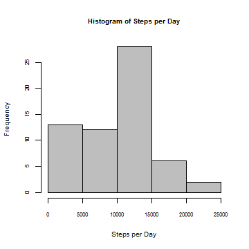
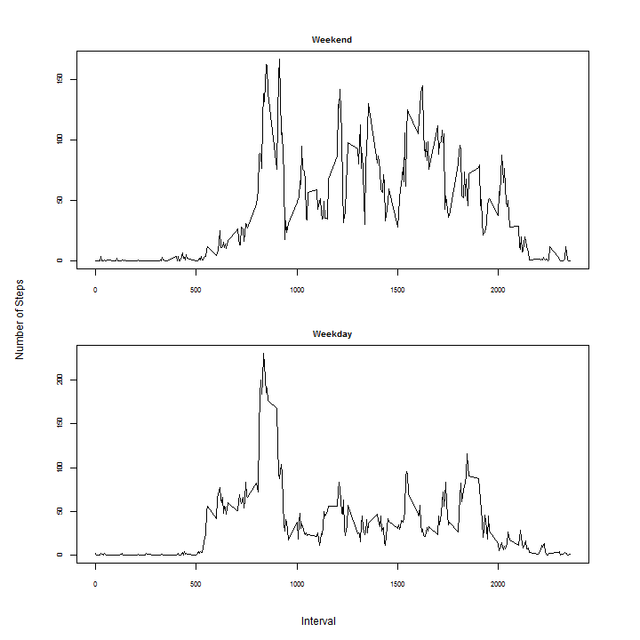

# Reproducible Research: Peer Assessment 1


## Loading and Preprocessing the Data

First, all of the required libraries are imported. In particular, `dplyr` is used for data frame manipulation, while `lattice` is used for printing.  
 

```r
## loading required packages
library(dplyr)
library(lattice)
```

Next, the activity data file is downloaded and loaded into the R environment as follows:

1. A temporary file is created on the system.
2. The data file is downloaded into the temporary file.
3. The data is then loaded from the temporary file into a `data.frame` object. Note that the first argument of the `read.csv(...)` function is a call to `unzip(...)` function, since the downloaded data file is in a compressed format.
4. The temporary file is deleted from the system to free up memory space.

In addition, a data summary is shown to gain insights into the structure of loaded data. 


```r
## url where the raw data file is stored
fileUrl <- "https://d396qusza40orc.cloudfront.net/repdata%2Fdata%2Factivity.zip"

## create a local temporary file for storing the data file
temp <- tempfile()

## download the file (in binary format)
download.file(fileUrl,temp, mode="wb")

## read the data into the data.frame object (after decompressing it)
activityData <- read.csv(unzip(temp, "activity.csv"), header=TRUE)

## delete the temporary file from the system
unlink(temp)

## show data summary
summary(activityData)
```

```
##      steps                date          interval     
##  Min.   :  0.00   2012-10-01:  288   Min.   :   0.0  
##  1st Qu.:  0.00   2012-10-02:  288   1st Qu.: 588.8  
##  Median :  0.00   2012-10-03:  288   Median :1177.5  
##  Mean   : 37.38   2012-10-04:  288   Mean   :1177.5  
##  3rd Qu.: 12.00   2012-10-05:  288   3rd Qu.:1766.2  
##  Max.   :806.00   2012-10-06:  288   Max.   :2355.0  
##  NA's   :2304     (Other)   :15840
```

Finally, data preprocessing is conducted. In particular, the `date` and `interval` variables are transformed  to factors (for data summarization across days and intervals).


```r
## date is transformed to factor
activityData$date <- as.factor(activityData$date)

## interval is transformed to factor object
activityData$interval <- as.factor(activityData$interval)
```

***

## What is mean total number of steps taken per day?

To answer the above question, first a new data frame is created by applying the `dplyr::group_by(...)` function over the `activityData` frame, with respect to the `date` variable. This step enables easier data manipulation for performing summary statistics (in this case over different days).


```r
## set date as grouping variable
activityPerDay <- group_by(activityData, date)
```

Next, the `activityPerDay` data frame is summarized by calculating total number of steps per day. Note that when calling the `sum(...)` function, missing values are ignored by setting the parameter `na.rm ` to a value `TRUE`. As an outcome, the resulting data frame will have no missing (of `NA` values). 


```r
## summarize the activity data over day by calling the sum function
stepsPerDay <- summarize(activityPerDay, count = sum(steps, na.rm = TRUE))

## show data summary
summary(stepsPerDay)
```

```
##          date        count      
##  2012-10-01: 1   Min.   :    0  
##  2012-10-02: 1   1st Qu.: 6778  
##  2012-10-03: 1   Median :10395  
##  2012-10-04: 1   Mean   : 9354  
##  2012-10-05: 1   3rd Qu.:12811  
##  2012-10-06: 1   Max.   :21194  
##  (Other)   :55
```

In order to gain insights into the total number of steps taken per day, a plot is created as follows:

1. First, the printing environment is configured to reduce the font size of the main title and the axis labels with a factor of 0.8, and the axis values with a factor of 0.7, in order to achieve better visibility.
2. A `graphics::barplot(...)` function is called to create the required plot, where the vertical bars represent the number of total steps taken per day.


```r
## configure the printing environment
par(cex.axis=0.7, cex.lab=0.8, cex.main=0.8)

## create a barplot where bars represent number of steps for each day
barplot(stepsPerDay$count, names = as.character(stepsPerDay$date), xlab = "Day", ylab = "Number of Steps", main = "Total Number of Steps per Day")
```

\

In addition, a histogram of the values representing the number of steps per day is created:

```r
## configure the printing environment
par(cex.axis=0.7, cex.lab=0.8, cex.main=0.8)

## create a histogram of the number of steps per day
hist(stepsPerDay$count, xlab="Steps per Day", main="Histogram of Steps per Day", col="gray")
```

\

Finally, the mean and median values of the number of steps per day are calculated as follows:


```r
## calculate the mean value of steps per day
meanStepsPerDay <- mean(stepsPerDay$count)

## calculate the median of steps per day
medianStepsPerDay <- median(stepsPerDay$count)
```

The obtained mean value of the steps per day is **_M_ = 9354.23**, while the median is **_Mdn_ = 10395**.

***

## What is the average daily activity pattern?

To address this question, a new data frame was created by applying the `dplyr::group_by(...)` function over the `activityData` frame, with respect to the `interval` variable.


```r
## set interval as grouping variable
activityPerInterval <- group_by(activityData, interval)
```

Next, the `activityPerInterval` data frame is summarized by calculating the average number of steps per interval. Note that when calling the `mean(...)` function, missing values are ignored by setting the parameter `na.rm` to `TRUE`. 


```r
## summarize the activity data over interval by calling the mean function
stepsPerInterval <- summarize(activityPerInterval, avg = mean(steps, na.rm = TRUE))

## show data summary
summary(stepsPerInterval)
```

```
##     interval        avg         
##  0      :  1   Min.   :  0.000  
##  5      :  1   1st Qu.:  2.486  
##  10     :  1   Median : 34.113  
##  15     :  1   Mean   : 37.383  
##  20     :  1   3rd Qu.: 52.835  
##  25     :  1   Max.   :206.170  
##  (Other):282
```

To gain insights into the average number of steps per interval, a line plot is created as follows:

1. First, the printing environment is configured to reduce the font size of the main title and the axis labels with a factor of 0.8, and the axis values with a factor of 0.7, in order to achieve better visibility.
2. A `graphics::plot(...)` function is called to create the required plot.


```r
## configure the printing environment
par(cex.axis=0.7, cex.lab=0.8, cex.main=0.8)

## create a line plot representing the average number of steps per interval
with(stepsPerInterval, plot(as.character(interval), avg, type="l", xlab="Interval", ylab="Average Number of Steps", main="Average Number of Steps per Interval"))
```

\

Finally, the interval containing the maximum average number of steps is identified as follows:  


```r
## obtaining the index of the interval containing the maximum number of steps
maxAvgStepsInd <- which.max(stepsPerInterval$avg)

## obtaining the interval factor for the index
maxAvgStepsInterval <- (stepsPerInterval[maxAvgStepsInd,])$interval
```

The interval containing the maximum average number of steps is **835**.

***

## Imputing missing values

First the number of missing values in the `activityData` frame is calculated.


```r
## get the logical vector indicating the positions of NA values
isNa <- is.na(activityData$steps)

## sum over the logical vector to obtain the number of missing values
naNumber<- sum(isNa)
```

The obtained results show that the number of missing values in the dataset is **2304**.

Next, a function which replaces the missing values with the average value of steps for a given interval is defined. The function takes two arguments:

- steps : the value to be checked (corresponding to a number of steps for a given observation)
- interval: the interval value for the investigated observation


```r
replaceMissingValues <- function(stepsVal, intervalVal) {
  
  ## if the value of steps is NA
  if (is.na(stepsVal)) {
    ## fetch the average number of steps for the given interval
    stepsVal <- (filter(stepsPerInterval, interval==intervalVal))$avg
  }
  ## return the stepsVal
  stepsVal
}
```

A copy of the `activityData` frame is created and the missing values are replaced with the average number of steps for a given interval by applying the previously defined function `replaceMissingValues(...)`.


```r
## coppy the activityData to a new variable activityDataNoMissing
activityDataNoMissing <- activityData

## apply the replace function to the activityDataNoMissing to fill in the missing data by using the mapply function
activityDataNoMissing$steps <- mapply(replaceMissingValues, activityDataNoMissing$steps, activityDataNoMissing$interval)

## show data summary
summary(activityDataNoMissing)
```

```
##      steps                date          interval    
##  Min.   :  0.00   2012-10-01:  288   0      :   61  
##  1st Qu.:  0.00   2012-10-02:  288   5      :   61  
##  Median :  0.00   2012-10-03:  288   10     :   61  
##  Mean   : 37.38   2012-10-04:  288   15     :   61  
##  3rd Qu.: 27.00   2012-10-05:  288   20     :   61  
##  Max.   :806.00   2012-10-06:  288   25     :   61  
##                   (Other)   :15840   (Other):17202
```

Further, a new data frame is created by applying the `dplyr::group_by(...)` function over the `activityDataNoMissing` frame, with respect to the `date` variable. In addition, the `activityPerDayNoMissing` frame is summarized by calculating the total number of steps per day. Note that in this case there is no need to specify the parameter `na.rm = TRUE` when calling the `sum(...)` function since all values were already filled.


```r
## set date as a grouping variable
activityPerDayNoMissing <- group_by(activityDataNoMissing, date)

## summarize the data over day by calling the sum function
stepsPerDayNoMissing <- summarize(activityPerDayNoMissing, count = sum(steps))

## show data summary
summary(stepsPerDayNoMissing)
```

```
##          date        count      
##  2012-10-01: 1   Min.   :   41  
##  2012-10-02: 1   1st Qu.: 9819  
##  2012-10-03: 1   Median :10766  
##  2012-10-04: 1   Mean   :10766  
##  2012-10-05: 1   3rd Qu.:12811  
##  2012-10-06: 1   Max.   :21194  
##  (Other)   :55
```

In order to gain insights into the total number of steps taken per day, a plot is created as follows:

1. First, the printing environment is configured to reduce the font size of the main title and the axis labels with a factor of 0.8, and the axis values with a factor of 0.7, in order to achieve better visibility.
2. A `graphics::barplot(...)` function is called to create the required plot, where the vertical bars represent the number of total steps taken per day.


```r
## configure the printing environment
par(cex.axis=0.7, cex.lab=0.8, cex.main=0.8)

## create a barplot where bars represent number of steps for each day
barplot(stepsPerDayNoMissing$count, names = as.character(stepsPerDayNoMissing$date), xlab="Day", ylab="Number of Steps", main="Total Number of Steps per Day (without missing values)")
```

\

In addition, a histogram of the values representing the number of steps per day is created:

```r
## configure the printing environment
par(cex.axis=0.7, cex.lab=0.8, cex.main=0.8)

## create a histogram of the number of steps per day
hist(stepsPerDayNoMissing$count, xlab="Steps per Day", main="Histogram of Steps per Day (without missing values)", col="gray")
```

\


Finally, the mean and median values of the number of steps taken per day are calculated as follows:


```r
## calculate the mean value of steps per day
meanStepsPerDayNoMissing <- mean(stepsPerDayNoMissing$count)

## calculate the median of steps per day
medianStepsPerDayNoMissing <- median(stepsPerDayNoMissing$count)
```

The obtained mean value of the steps per day in the new dataset without missing values is **_M_ = 10766.19**, while the median is **_Mdn_ = 10766.19**. These values **differ** from the original values. The mean value is now **larger** than the original one. In addition, the `count` variable is now more normally distributed. Finally, the total number of steps (656737.51) is **larger** than the initial one (570608). A summary regarding other statistics is shown in continuation:


```r
## summary statistics of steps per day
summary(stepsPerDay$count)
```

```
##    Min. 1st Qu.  Median    Mean 3rd Qu.    Max. 
##       0    6778   10400    9354   12810   21190
```

```r
## summary statistics of steps per day (without missing values)
summary(stepsPerDayNoMissing$count)
```

```
##    Min. 1st Qu.  Median    Mean 3rd Qu.    Max. 
##      41    9819   10770   10770   12810   21190
```

***

## Are there differences in activity patterns between weekdays and weekends?

For the final question, an additional variable is added to the activity dataset (without the missing values). This new variable which represents a factor indicating whether a day is a weekend or a workday:


```r
## set the locale to English to ensure proper functioning of the next line of code
Sys.setlocale("LC_ALL", "English")

## create the new factor variable with values 'weekend' or 'weekday'
activityDataNoMissing$wday <- factor((weekdays(as.Date(as.character(activityDataNoMissing$date))) %in% c("Saturday", "Sunday")),levels=c(TRUE, FALSE), labels=c("weekend", "weekday"))
```

Further, a new data frame is created by applying the `dplyr::group_by(...)` function over the `activityDataNoMissing` frame, with respect to the `interval` and `wday` variables. In addition, the obtained `activityPerIntervalAndWeekday` frame is summarized by calculating the average number of steps per interval and weekday.


```r
## set interval as a grouping variable
activityPerIntervalAndWeekday <- group_by(activityDataNoMissing, interval, wday)

## summarize the data over interval by calling the mean function
stepsPerIntervalAndWeekday <- summarize(activityPerIntervalAndWeekday, avg = mean(steps))

## show data summary
summary(stepsPerIntervalAndWeekday)
```

```
##     interval        wday          avg         
##  0      :  2   weekend:288   Min.   :  0.000  
##  5      :  2   weekday:288   1st Qu.:  2.047  
##  10     :  2                 Median : 28.133  
##  15     :  2                 Mean   : 38.988  
##  20     :  2                 3rd Qu.: 61.263  
##  25     :  2                 Max.   :230.378  
##  (Other):564
```

Finally, a planel plot is created to illustrate the average number of steps per interval on weekends versus weekdays:

1. First the data frame is divided into `weekend` and `workday` frames to separate the records that correspond to the type of day
2. Next, the printing environment is configured to define the panel plot layout and to reduce the font size of the main title, the axis labels and values.
3. A `graphics::plot(...)` function is called twice to create the required plots for each data set.


```r
## divide the frame into two separate frames, each containing only records for the selected day type
weekend <- stepsPerIntervalAndWeekday[stepsAveragePerIntervalAndWeekday$wday == "weekend",]
weekday <- stepsPerIntervalAndWeekday[stepsAveragePerIntervalAndWeekday$wday == "weekday",]

## configure the printing environment
par(mfrow = c(2,1), cex.axis=0.7, cex.lab=0.8, cex.main=0.8, mar = c(4, 4, 2, 2), oma = c(2, 2, 2, 2))

## create the plots
with(weekend, plot(as.character(interval), avg, type="l", xlab="", ylab="", main="Weekend"))
with(weekday, plot(as.character(interval), avg, type="l", xlab="", ylab="", main="Weekday"))

## set the "axis" labels for both plots as outer text
mtext("Interval", side=1, outer=TRUE) 
mtext("Number of Steps", side=2, outer=TRUE)
```

\

Alternatively, the same information can be communicated with the `lattice` package to correspond to the example given in the project description:

```r
xyplot(avg ~ as.numeric(as.character(interval)) | wday, data = stepsPerIntervalAndWeekday, layout = c(1, 2), type="l", ylab="Number of steps", xlab="Interval")
```

***
